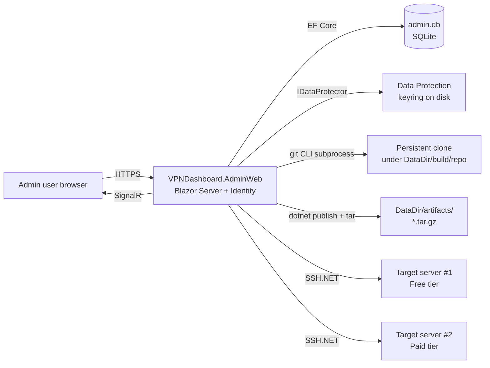

## High-level architecture



Same stack as the existing site (Blazor Server, EF Core SQLite, ASP.NET Identity, SignalR) so deploy/ops patterns are reused.

## Solution layout (after change)

- `src/VPNDashboard.Website/` — unchanged (the product being deployed).
- `src/VPNDashboard.AdminWeb/` — **new**.
- [VPNDashboard.Website.sln](VPNDashboard.Website.sln) — add the new project under the existing `src` solution folder (mirrors the existing pattern at lines 6–9 of the .sln).
- `deploy/install-adminweb.sh` + `deploy/vpndashboard-admin.service` — sister scripts modelled on [deploy/install.sh](deploy/install.sh) for installing AdminWeb on a Linux host.

## Project: `VPNDashboard.AdminWeb`

### Packages
- `Microsoft.AspNetCore.Identity.EntityFrameworkCore` 8.0.* (login + roles)
- `Microsoft.EntityFrameworkCore.Sqlite` 8.0.*
- `Microsoft.EntityFrameworkCore.Tools` 8.0.*
- `Microsoft.AspNetCore.DataProtection` 8.0.* with `Microsoft.AspNetCore.DataProtection.Extensions` (reversible encryption of stored passwords)
- `SSH.NET` 2024.* (`Renci.SshNet`) — for `ScpClient` upload + `SshClient.RunCommand` execution + `systemctl is-active` status checks
- `Microsoft.AspNetCore.SignalR` 8.0.* (live build/deploy logs)

### Roles
- `Admin` — full CRUD on servers, build, deploy, manage users.
- `Operator` — view servers, run deploys of existing artifacts (no build, no CRUD).
- `Viewer` — dashboard only (read-only).

Seed via `VPNDASH_ADMIN_EMAIL` / `VPNDASH_ADMIN_PASSWORD` env vars, same pattern as [src/VPNDashboard.Website/Program.cs](src/VPNDashboard.Website/Program.cs) lines 81–107.

### Data model (`Models/`)

```csharp
public enum ServerTier { Free, Paid }

public class TargetServer
{
    public int Id { get; set; }
    public string Name { get; set; } = "";
    public ServerTier Tier { get; set; }
    public string Host { get; set; } = "";
    public int Port { get; set; } = 22;
    public string Username { get; set; } = "";
    public byte[] PasswordEncrypted { get; set; } = Array.Empty<byte>();
    public string InstallDir { get; set; } = "/var/www/vpndashboard";
    public string ServiceName { get; set; } = "vpndashboard";
    public string ServiceUser { get; set; } = "www-data";
    public string? Notes { get; set; }
    public DateTime CreatedAt { get; set; }
    public DateTime? LastDeployedAt { get; set; }
    public string? LastDeployedCommitSha { get; set; }
    public string? LastDeployedArtifactName { get; set; }
}

public class BuildArtifact
{
    public int Id { get; set; }
    public string FileName { get; set; } = "";    // vpndashboard-main-abc1234.tar.gz
    public string Branch { get; set; } = "";
    public string CommitSha { get; set; } = "";
    public string CommitMessage { get; set; } = "";
    public string CommitAuthor { get; set; } = "";
    public DateTime CommitDate { get; set; }
    public DateTime BuiltAt { get; set; }
    public long SizeBytes { get; set; }
}

// Singleton row (Id always = 1) — editable from the UI
public class BuildSettings
{
    public int Id { get; set; }
    public string RepositoryUrl { get; set; } = "";       // e.g. https://github.com/DrTJ/VPNDashboard.Website.git
    public string DefaultBranch { get; set; } = "main";
    public string ProjectPath { get; set; } = "src/VPNDashboard.Website/VPNDashboard.Website.csproj";
    public byte[]? GitHubTokenEncrypted { get; set; }     // optional, for private repos
    public string? GitHubUsername { get; set; }           // optional, paired with token for HTTPS auth
    public DateTime UpdatedAt { get; set; }
    public string? UpdatedBy { get; set; }
}
```

`AdminDbContext : IdentityDbContext<IdentityUser>` adds `DbSet<TargetServer>` and `DbSet<BuildArtifact>` (mirrors structure of [src/VPNDashboard.Website/Data/AppDbContext.cs](src/VPNDashboard.Website/Data/AppDbContext.cs)).

### Credential encryption (reversible)

```csharp
public sealed class CredentialProtector(IDataProtectionProvider provider)
{
    private readonly IDataProtector _p = provider.CreateProtector("VPNDashboard.AdminWeb.ServerCredentials.v1");
    public byte[] Protect(string plain) => _p.Protect(Encoding.UTF8.GetBytes(plain));
    public string Unprotect(byte[] cipher) => Encoding.UTF8.GetString(_p.Unprotect(cipher));
}
```

`Program.cs`:

```csharp
builder.Services.AddDataProtection()
    .PersistKeysToFileSystem(new DirectoryInfo("/var/lib/vpndashboard-admin/keys"))
    .SetApplicationName("VPNDashboard.AdminWeb");
```

Important caveat to surface in README: the keyring is the master key; back it up. Without it, all stored passwords become unreadable.

### Pages (Blazor `Components/Pages/`)

1. `Dashboard.razor` (`/`) — two columns: **Paid Servers** and **Free Servers**, each rendering server cards (name, host, "service active" pill via `IServerStatusService.GetStatusAsync` with 30s in-memory cache, "Manage" button).
2. `Servers.razor` (`/servers`) — table + Add/Edit/Delete buttons. `ServerForm.razor` component handles fields; password input has "Leave blank to keep current". Includes a **Test connection** button that runs a no-op SSH command and reports latency.
3. `ServerDetail.razor` (`/servers/{id:int}`) — overview, last deployment info, **Deploy** flow:
   - Dropdown of artifacts (most recent first) with commit SHA, date, message.
   - Click "Deploy" → SignalR-streamed log panel shows scp upload progress and remote command output.
4. `Build.razor` (`/build`) — covers requirements 4–6:
   - Branch input (default `main`).
   - **Fetch & preview** button → backend `git fetch` + `git rev-parse origin/<branch>` + `git log -1 --format=...` → renders a confirmation card with SHA, author, date, message.
   - **Build & package** button (disabled until previewed) → starts a background build job; live `<pre>` panel streams every line of `git`, `dotnet publish`, and `tar` output via SignalR.
   - On success: shows artifact filename + size + "Go to Servers to deploy" link.
5. `Artifacts.razor` (`/artifacts`) — list of artifacts, delete old ones.
6. `BuildSettings.razor` (`/settings/build`, **Admin-only**) — edit the GitHub repository config from the UI:
   - Repository URL (text)
   - Default branch (text)
   - Project path within repo (text, defaults to `src/VPNDashboard.Website/VPNDashboard.Website.csproj`)
   - GitHub username (text, optional)
   - GitHub token (password input with "Leave blank to keep current"; encrypted via `CredentialProtector` before storage)
   - **Test access** button: runs `git ls-remote <url>` (with token if set) in a subprocess, surfaces success/failure inline.
   - **Save** persists; if `RepositoryUrl` changed, the next build deletes/re-clones the workspace (the `IGitWorkspace` checks the saved URL against `git remote get-url origin` and re-clones on mismatch).
7. Standard `Account/Login.razor`, `Account/Logout.razor`, `Account/Users.razor` (Admin-only role assignment) — same shape as existing site.

### Services (`Services/`)

```csharp
public interface IServerStore                 // CRUD wrapping CredentialProtector
public interface IBuildSettingsStore           // Get()/Save() the singleton BuildSettings row, encrypts/decrypts token
public interface ISshSessionFactory           // builds Renci.SshNet ConnectionInfo from a TargetServer (fetches & decrypts password on demand)
public interface IServerStatusService         // ssh `systemctl is-active <name>`, cached
public interface IGitWorkspace                // EnsureCloned(settings), Fetch(), Checkout(branch), GetHeadCommit() — re-reads settings every call
public interface IBuildService                // BuildAsync(branch, IProgress<string>) -> BuildArtifact
public interface IDeployService               // DeployAsync(server, artifact, IProgress<string>)
public interface ILiveLogHub                  // SignalR hub bridging IProgress<string> to clients
```

`IBuildService` runs (subprocess; streams stdout/stderr line-by-line):

```bash
git -C <repoDir> fetch --all --prune
git -C <repoDir> checkout <branch>
git -C <repoDir> reset --hard origin/<branch>
dotnet publish <repoDir>/src/VPNDashboard.Website/VPNDashboard.Website.csproj \
    -c Release -o <buildOut> --nologo
find <buildOut> -name '*.pdb' -delete
rm -f <buildOut>/appsettings.Development.json
tar -czf <artifactDir>/vpndashboard-<branch>-<shortSha>.tar.gz -C <buildOut> .
```

Repo URL, default branch, project path, and GitHub credentials all live in the `BuildSettings` SQLite row and are edited from the **`/settings/build`** page (Admin-only). `appsettings.json` only provides the **first-run seed values** (used the very first time the app starts when the row doesn't exist yet); after that the DB is the source of truth and `IBuildService` reads from `IBuildSettingsStore` on every build. For private repos, the saved token is decrypted at build time and injected as `https://<username>:<token>@github.com/...` in the clone URL — never written to disk in plaintext, never printed in the streamed logs (the build runner masks the token in any output line).

`IDeployService` uses SSH.NET (no `sshpass` / `scp` binary required on host):

```csharp
using var scp = new ScpClient(connInfo);
scp.Connect();
using var fs = File.OpenRead(artifactPath);
scp.Upload(fs, "/tmp/vpndashboard.tar.gz");

using var ssh = new SshClient(connInfo);
ssh.Connect();
var cmd = ssh.CreateCommand($@"
set -e
sudo systemctl stop {server.ServiceName}
sudo mkdir -p {server.InstallDir}
sudo tar -xzvf /tmp/vpndashboard.tar.gz -C {server.InstallDir}
sudo chown -R {server.ServiceUser}:{server.ServiceUser} {server.InstallDir}
sudo systemctl start {server.ServiceName}
sudo systemctl --no-pager --lines=10 status {server.ServiceName}
");
// stream cmd.OutputStream / ExtendedOutputStream line-by-line via IProgress<string>
```

Updates `LastDeployedAt`, `LastDeployedCommitSha`, `LastDeployedArtifactName` on success.

**Sudo note**: requires the configured `Username` to have NOPASSWD sudo for `systemctl`, `mkdir`, `tar`, `chown` (or to be `root`). The Server form will surface this requirement; "Test connection" will probe `sudo -n true` and warn if it fails.

### Configuration (`appsettings.json`)

```json
{
  "ConnectionStrings": { "DefaultConnection": "Data Source=/var/lib/vpndashboard-admin/admin.db" },
  "DataProtection": { "KeyDirectory": "/var/lib/vpndashboard-admin/keys" },
  "Build": {
    "WorkDir": "/var/lib/vpndashboard-admin/build",
    "ArtifactDir": "/var/lib/vpndashboard-admin/artifacts",
    "Seed": {
      "RepositoryUrl": "https://github.com/DrTJ/VPNDashboard.Website.git",
      "DefaultBranch": "main",
      "ProjectPath": "src/VPNDashboard.Website/VPNDashboard.Website.csproj"
    }
  },
  "Kestrel": { "Endpoints": { "Http": { "Url": "http://0.0.0.0:5050" } } }
}
```

### Live log streaming

Single SignalR hub `LiveLogHub` with two groups: `build-{jobId}` and `deploy-{jobId}`. The Build and ServerDetail pages join the relevant group and append every received line to a `<pre>` panel; auto-scrolls to bottom; final message includes `EXIT 0` / `EXIT n` so the UI knows when to enable buttons again.

## Documentation (added requirement)

Two parallel doc sets, both rendered in-app via the same Markdig pattern already used at [src/VPNDashboard.Website/Components/Pages/Docs.razor](src/VPNDashboard.Website/Components/Pages/Docs.razor) (auto-discovers `*.md` files in a configured folder, sidebar TOC, syntax-highlighted code blocks).

### Folder layout

```
docs/
├── website/                 # docs for VPNDashboard.Website (end users + sysadmins)
│   ├── README.md
│   ├── INSTALL-FEDORA.md    # already exists, move under website/
│   ├── INSTALL-UBUNTU.md    # already exists
│   ├── CONFIGURATION.md     # already exists
│   ├── OPENVPN-SETUP-WIZARD.md
│   ├── OPENVPN-UNINSTALL.md
│   ├── OPERATIONS.md
│   ├── SECURITY.md
│   ├── UNINSTALL.md
│   ├── USERS-AND-SUBSCRIPTIONS.md   # NEW — covers Identity, roles, SubscriptionService
│   ├── CLIENTS.md                   # NEW — managing OpenVPN clients (download .ovpn etc.)
│   └── DASHBOARD-PAGES.md           # NEW — quick reference for each Razor page
└── adminweb/                # NEW — docs for VPNDashboard.AdminWeb
    ├── README.md
    ├── GETTING-STARTED.md
    ├── INSTALL-LINUX.md
    ├── CONFIGURATION.md
    ├── SERVERS.md            # adding/editing/deleting target servers, tier model
    ├── BUILDING.md           # branch input, fetch & preview, build & package, log streaming
    ├── DEPLOYING.md          # one-click deploy flow, sudo NOPASSWD reqs
    ├── USERS-AND-ROLES.md    # Admin / Operator / Viewer
    ├── SECURITY.md           # data-protection keyring, password storage model, backup
    ├── TROUBLESHOOTING.md
    └── ARCHITECTURE.md       # mirror of the diagram + service breakdown above
```

The existing top-level `docs/*.md` files move under `docs/website/` (a small follow-up to the existing site's `OpenVpnSettings.DocsPath` — point the existing site at `docs/website` so its `/docs` page keeps working).

### In-app rendering

Add `Components/Pages/Docs.razor` to AdminWeb, copied from the existing site with two changes:

- Drop the `IOptions<OpenVpnSettings>` injection; use `IOptions<DocsSettings>` (or just a config string) pointing at `docs/adminweb`.
- Sidebar groups files by the leading `NN-` prefix if present (so authors can order via filenames like `01-GETTING-STARTED.md`); otherwise keep alphabetical with `README.md` first (matches existing line 102 ordering trick).

Wire docs into the publish bundle in `VPNDashboard.AdminWeb.csproj`:

```xml
<ItemGroup>
  <Content Include="..\..\docs\adminweb\**\*.md" Link="docs\%(RecursiveDir)%(Filename)%(Extension)">
    <CopyToOutputDirectory>PreserveNewest</CopyToOutputDirectory>
  </Content>
</ItemGroup>
```

The `Docs.razor` lookup logic from [src/VPNDashboard.Website/Components/Pages/Docs.razor](src/VPNDashboard.Website/Components/Pages/Docs.razor) lines 90–113 already falls back through configured path → `docs` → `Path.Combine(AppContext.BaseDirectory, "docs")`, so the same pattern works for both projects unchanged.

### Doc content scope (what each file should contain)

**`docs/adminweb/`:**

- `README.md` — what AdminWeb is, screenshots placeholder, links to Getting Started + Install.
- `GETTING-STARTED.md` — five-minute walkthrough: log in → add a server → build main → deploy.
- `INSTALL-LINUX.md` — running `deploy/install-adminweb.sh`, env vars (`VPNDASH_ADMIN_EMAIL`, `VPNDASH_ADMIN_PASSWORD`, `Build__GitHubToken`), nginx + TLS, firewall, **backing up the DataProtection keyring**.
- `CONFIGURATION.md` — every `appsettings.json` key, every env var override, default paths.
- `SERVERS.md` — fields explained (especially `ServiceUser` / `ServiceName` / `InstallDir`), Free vs Paid tier semantics, password rotation, "Test connection" outcomes, **target-host sudoers requirement** (sample `/etc/sudoers.d/vpndashboard` file).
- `BUILDING.md` — branch input, what "Fetch & preview" does, what gets stripped (`*.pdb`, `appsettings.Development.json`), where artifacts land, naming convention `vpndashboard-<branch>-<shortSha>.tar.gz`, private-repo token setup.
- `DEPLOYING.md` — exact remote commands run (the stop/extract/chown/start sequence), what "EXIT 0" means, retry semantics, rollback workaround (deploy a previous artifact).
- `USERS-AND-ROLES.md` — Admin/Operator/Viewer permission matrix table, how to seed the first admin, how to add additional users.
- `SECURITY.md` — threat model, password-encryption model (Data Protection, reversible by design), keyring backup, why HTTPS in front is mandatory, audit log pointers.
- `TROUBLESHOOTING.md` — "service not active" reasons, sudo failures, git auth errors, build failures, SignalR/log-streaming issues.
- `ARCHITECTURE.md` — embed the high-level mermaid diagram from this plan + per-service responsibilities.

**`docs/website/` (NEW or updated):**

- `USERS-AND-SUBSCRIPTIONS.md` — Identity setup, roles (Admin/Viewer), subscription model based on [src/VPNDashboard.Website/Services/SubscriptionService.cs](src/VPNDashboard.Website/Services/SubscriptionService.cs), how `SubscriptionScheduler` runs.
- `CLIENTS.md` — generating client configs, downloading `.ovpn` (the `/api/download/{clientName}.ovpn` endpoint at [src/VPNDashboard.Website/Program.cs](src/VPNDashboard.Website/Program.cs) lines 173–186), revoking clients.
- `DASHBOARD-PAGES.md` — one paragraph per Razor page (`Index`, `Clients`, `Connected`, `Server`, `Setup`, `Subscriptions`, `Docs`).

### Style + tooling

- Markdown only, no MkDocs/DocFX layer (keeps the in-app reader as the single source of truth).
- Use fenced code blocks with language hints so the existing `highlightAllCode` JS (called at line 86 of `Docs.razor`) syntax-highlights them.
- Each doc starts with an H1 title; sidebar uses the filename, so prefix files with `NN-` only if ordering matters.
- Add `docs/STYLE.md` (one-pager) describing this convention so future docs stay consistent.

### Deploying AdminWeb itself (Linux server)

- `deploy/install-adminweb.sh` — clones [deploy/install.sh](deploy/install.sh) but installs to `/opt/vpndashboard-admin`, creates user `vpndashadmin`, sets up `vpndashboard-admin.service`, listens on `:5050`, nginx vhost reverse-proxies a chosen hostname to it. Reuses the same self-signed cert pattern.
- AdminWeb host needs system packages: `git`, `dotnet-sdk-8.0` (the SDK, not just the runtime, because we run `dotnet publish` at runtime), `tar`. The installer adds them.

### Open assumptions (proceeding unless you object)

- Build workspace = persistent clone at `<DataDir>/build/repo`, `git fetch`/`checkout`/`reset --hard` per build. If the `RepositoryUrl` saved in `BuildSettings` differs from `git remote get-url origin`, the workspace is wiped and re-cloned automatically before the next build.
- First-run seed for `BuildSettings` = `https://github.com/DrTJ/VPNDashboard.Website.git` / branch `main` (from [docs/manual Scripts.sh](docs/manual%20Scripts.sh) line 1). Admin can change all of these from `/settings/build` afterwards.
- One artifact = one `.tar.gz` per `(branch, commit SHA)`; rebuilding the same SHA overwrites.
- Deployment SSH auth = password (encrypted at rest, decrypted at use). SSH-key auth can be added later as a `KeyPath` column on `TargetServer`.

### Out of scope (flagging for follow-ups)

- One-click multi-server deploy (fanout) — single-server deploys only in v1.
- Rollback to a prior artifact (data is there; just no UI yet).
- Webhook / CI-triggered builds.
- Per-server build (right now one artifact deploys to all targets — they all run the same VPNDashboard.Website binary).