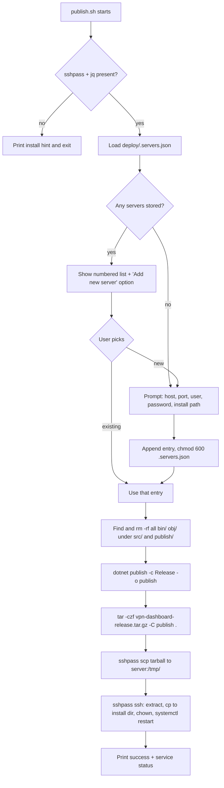

## Goal

One-shot publish workflow that mirrors the manual steps in [docs/manual Scripts.sh](docs/manual%20Scripts.sh) but: (a) cleans the workspace first, (b) remembers servers across runs, and (c) does the full remote install in one go.

## Files to create

- [deploy/publish.sh](deploy/publish.sh) — the interactive script (chmod +x).
- [deploy/.servers.json](deploy/.servers.json) — created on first run, **not** committed.
- Append `deploy/.servers.json` to [.gitignore](.gitignore) so passwords never land in git.

## Dependencies (host machine)

- `dotnet` 8 SDK (already required).
- `tar`, `scp`, `ssh` (standard on macOS/Linux).
- `sshpass` — needed to pass stored passwords non-interactively. The script checks for it on startup and prints the install hint (`brew install sshpass` on macOS, `dnf install sshpass` on Fedora) if missing.
- `jq` — for clean JSON read/write. Same fallback message if missing (`brew install jq`).

## Script flow



## Stored JSON shape

`deploy/.servers.json`:

```json
{
  "servers": [
    {
      "name": "prod-hetzner",
      "host": "5.161.115.89",
      "port": 22,
      "user": "root",
      "password": "...",
      "installDir": "/opt/vpn-dashboard",
      "serviceUser": "vpndash",
      "serviceName": "vpn-dashboard"
    }
  ]
}
```

Defaults match [docs/manual Scripts.sh](docs/manual%20Scripts.sh) (`/opt/vpn-dashboard`, user `vpndash`, service `vpn-dashboard`) so the user can just press Enter through them.

## Key script sections (sketch)

Clean step (handles `bin`, `obj`, and `publish` at the repo root):

```bash
PROJECT_ROOT="$(cd "$(dirname "${BASH_SOURCE[0]}")/.." && pwd)"
echo "[1/5] Cleaning bin/, obj/, publish/..."
find "$PROJECT_ROOT/src" -type d \( -name bin -o -name obj \) -prune -exec rm -rf {} +
rm -rf "$PROJECT_ROOT/publish"
```

Build + pack:

```bash
echo "[2/5] Building (Release)..."
dotnet publish "$PROJECT_ROOT/src/VPNDashboard.Website/VPNDashboard.Website.csproj" \
    -c Release -o "$PROJECT_ROOT/publish" --nologo

TARBALL="$PROJECT_ROOT/vpn-dashboard-release.tar.gz"
echo "[3/5] Creating $TARBALL ..."
tar -czf "$TARBALL" -C "$PROJECT_ROOT/publish" .
```

Server selection (uses `jq` to enumerate; option `0` = add new):

```bash
mapfile -t NAMES < <(jq -r '.servers[].name' "$CFG")
for i in "${!NAMES[@]}"; do printf "  %d) %s\n" "$((i+1))" "${NAMES[$i]}"; done
echo "  0) Add new server..."
read -rp "Select server: " idx
```

Upload + remote deploy (single ssh, heredoc — mirrors steps 2 & 3 of [docs/manual Scripts.sh](docs/manual%20Scripts.sh)):

```bash
SSHPASS="$PASSWORD" sshpass -e scp -P "$PORT" "$TARBALL" "$USER@$HOST:/tmp/"

SSHPASS="$PASSWORD" sshpass -e ssh -p "$PORT" "$USER@$HOST" bash -s <<EOF
set -euo pipefail
mkdir -p /tmp/vpn-dashboard-extract
tar xzf /tmp/vpn-dashboard-release.tar.gz -C /tmp/vpn-dashboard-extract
mkdir -p $INSTALL_DIR
cp -rf /tmp/vpn-dashboard-extract/* $INSTALL_DIR/
chown -R $SERVICE_USER:$SERVICE_USER $INSTALL_DIR/
systemctl restart $SERVICE_NAME
systemctl --no-pager --lines=5 status $SERVICE_NAME
rm -rf /tmp/vpn-dashboard-extract /tmp/vpn-dashboard-release.tar.gz
EOF
```

`StrictHostKeyChecking` will prompt on first connection; the script will pass `-o StrictHostKeyChecking=accept-new` to avoid hanging on automation while still recording the host key.

## Security notes (surfaced to the user)

- `deploy/.servers.json` is `chmod 600` and added to `.gitignore`. Passwords are still stored plaintext — same trust model as `~/.netrc`. The script prints a one-time warning when creating the file recommending an SSH key + `ssh-copy-id` instead. (We can revisit auth modes later — see Q1 in chat.)
- `set -euo pipefail` everywhere; `trap` cleans the local tarball on failure if desired (kept by default for retry).

## Out of scope (call out for confirmation if needed)

- Running EF migrations / seeding admin on the remote — the existing `vpn-dashboard.service` handles startup behavior.
- Multi-server fanout (deploy to N servers in one run) — not asked for.
- Windows host support (the script is Bash; works from macOS/Linux/WSL).