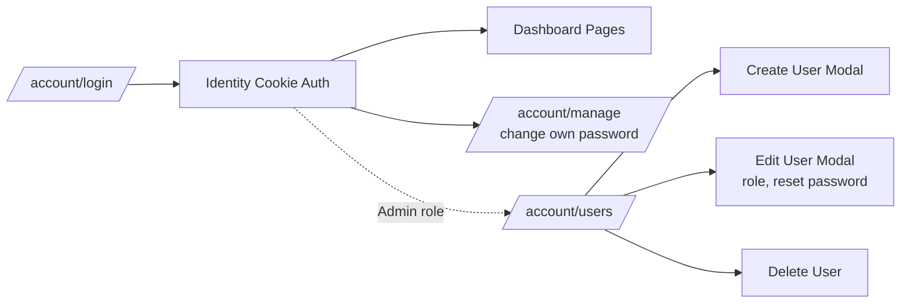

## Goals

- Two roles: **Admin** (full access, can manage users + mutate VPN state) and **Viewer** (read-only).
- Admin creates users via UI and sets an initial password; user can change it later from `/account/manage`.
- Enforce role checks both in UI (hide buttons) and on the server (`[Authorize(Roles="Admin")]` / policy on endpoints).

## Architecture overview



## 1. Roles & seeding

In [src/VPNDashboard.Website/Program.cs](src/VPNDashboard.Website/Program.cs):

- Seed both roles `Admin` and `Viewer` (currently only `Admin` is created).
- Add an authorization policy so we can use it on minimal-API endpoints:

```csharp
builder.Services.AddAuthorization(options =>
{
    options.AddPolicy("AdminOnly", p => p.RequireRole("Admin"));
});
```

- Keep the env-var seeded user assigned to `Admin` (already done).

## 2. User management service

Create `src/VPNDashboard.Website/Services/UserAdminService.cs` wrapping `UserManager<IdentityUser>`/`RoleManager<IdentityRole>`:

- `Task<List<UserListItem>> ListAsync()` — returns id, email, role, lockout state.
- `Task<IdentityResult> CreateAsync(string email, string password, string role)`
- `Task<IdentityResult> SetRoleAsync(string userId, string role)` — replaces role, blocks demoting the last Admin.
- `Task<IdentityResult> ResetPasswordAsync(string userId, string newPassword)` — uses `RemovePasswordAsync` + `AddPasswordAsync`.
- `Task<IdentityResult> DeleteAsync(string userId, string currentUserId)` — blocks deleting yourself or the last Admin.
- `Task<IdentityResult> ChangeOwnPasswordAsync(IdentityUser user, string current, string @new)`

Register as scoped in `Program.cs`.

## 3. Pages (Blazor)

All under `src/VPNDashboard.Website/Components/Pages/Account/`:

- **`Users.razor`** at `/account/users`, `[Authorize(Roles="Admin")]`, `@rendermode InteractiveServer`
  - Table: email, role badge, status, actions (Edit role, Reset password, Delete).
  - "New user" button opens a modal: email, password (with the existing Identity password rules), role select (Admin/Viewer).
  - Two more modals for "Reset password" and "Delete".
  - Pattern matches existing [Clients.razor](src/VPNDashboard.Website/Components/Pages/Clients.razor) (modals + busy state + alert message).

- **`Manage.razor`** at `/account/manage`, `[Authorize]`
  - Shows current email (read-only).
  - Form: current password, new password, confirm. Calls `UserManager.ChangePasswordAsync`.
  - Replaces the currently-broken `/account/manage` link in [MainLayout.razor](src/VPNDashboard.Website/Components/Layout/MainLayout.razor).

## 4. Navigation & UI gating

In [src/VPNDashboard.Website/Components/Layout/NavMenu.razor](src/VPNDashboard.Website/Components/Layout/NavMenu.razor):

- Add an `ADMINISTRATION` section with a "Users" link wrapped in `<AuthorizeView Roles="Admin">`.

In existing pages, wrap mutating controls in `<AuthorizeView Roles="Admin">` so Viewers see read-only:

- [Clients.razor](src/VPNDashboard.Website/Components/Pages/Clients.razor): "Add Client" button and the Revoke button column.
- [Server.razor](src/VPNDashboard.Website/Components/Pages/Server.razor): Reload/restart/start/stop and any mutating buttons.
- `Setup.razor`: install action.
- `.ovpn` download stays available to all authenticated users (Viewers need to download configs).

## 5. Server-side enforcement

In [Program.cs](src/VPNDashboard.Website/Program.cs):

- The login redirect middleware stays as-is.
- The `/account/logout` endpoint stays as-is.
- Add nothing new for the `.ovpn` download (any authenticated user is fine).
- Future-proofing: any new minimal-API endpoint that mutates state should use `.RequireAuthorization("AdminOnly")`.

For mutating actions in Razor components, add a server-side guard in the handler (e.g. `if (!user.IsInRole("Admin")) return;`) using `AuthenticationStateProvider`, since hiding the button alone isn't enough when the component is rendered server-side and methods are reachable via the circuit's component instance. Simplest: add `[Authorize(Roles = "Admin")]` to the page itself for admin-only pages and rely on `<AuthorizeView>` for per-button gating on shared pages, plus a role check at the top of mutating methods (`AddClient`, `RevokeClient`, server actions).

## 6. Database migration

`AppDbContext` is unchanged (uses default Identity tables). No new migration is required — Identity already has `AspNetUsers`, `AspNetRoles`, `AspNetUserRoles`.

## 7. Docs

Briefly note the new roles and `/account/users` page in [docs/INSTALL-UBUNTU.md](docs/INSTALL-UBUNTU.md) and [docs/INSTALL-FEDORA.md](docs/INSTALL-FEDORA.md) where the env-var admin seeding is described.

## Out of scope (can be added later)

- Email confirmation / password-reset emails (no SMTP configured).
- Two-factor auth.
- Account lockout UI (the data is there but not exposed).
- Audit log of admin actions.