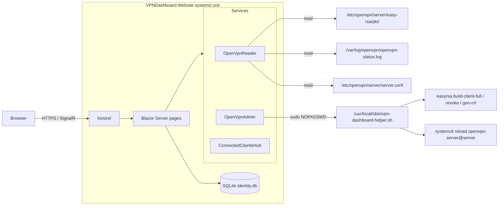

## Goals

- **Install OpenVPN from the UI** if it isn't already installed (first-run wizard that drives Nyr's `openvpn-install.sh` non-interactively).
- **Uninstall OpenVPN from the UI** — a "Danger zone" action that fully removes the OpenVPN package, configs, firewall rules, SELinux port mapping and systemd unit (the same teardown Nyr's script does in option 3).
- Manage all OpenVPN client profiles (list, add, revoke, download `.ovpn`).
- Show currently connected clients live (auto-refresh, no manual reload).
- Show server status (service active, port, protocol, uptime, throughput).
- Secure behind admin login (ASP.NET Core Identity + SQLite).
- Run as a systemd service on the same Fedora host as OpenVPN.
- Use the AdminLTE 4 admin template as the UI shell (sidebar, topbar, cards, info-boxes, tables, login page) for a polished, familiar look with no custom design work.

## Architecture



## How we interact with the OpenVPN install ([openvpn-install.sh-0.md](/Users/drtj/.cursor/projects/Volumes-Data-Projects-RoyaPajoohesh-VPNDashboard-VPNDashboard-Website/uploads/openvpn-install.sh-0.md))

- **Install OpenVPN (first run, server.conf missing)** — the Setup wizard collects: public IPv4/hostname (auto-detected default), protocol (UDP/TCP), port (1194), DNS choice (1–8), first client name. The helper then runs the **vendored** copy of Nyr's script at `/opt/vpn-dashboard/openvpn-install.sh` (no network download — committed to the repo under `deploy/openvpn-install.sh` and copied during install), feeding answers via stdin:

  ```bash
  { sleep 0.2; printf '%s\n' "$ip" "$proto" "$port" "$dns" "$client" ""; } \
    | bash /opt/vpn-dashboard/openvpn-install.sh
  ```

  The leading `sleep 0.2` is required because Nyr's script does `read -N 999999 -t 0.001` on line 18 to discard pending stdin; if we write before that returns, our first answer is eaten. The trailing empty line acks the "Press any key to continue" prompt. Output is captured line-by-line and streamed to the browser via the installer SignalR hub.
- **Uninstall OpenVPN (server.conf present)** — same script, option 3. Helper runs:

  ```bash
  { sleep 0.2; printf '%s\n' "3" "y"; } | bash /opt/vpn-dashboard/openvpn-install.sh
  ```

  This is the path Nyr's script takes at lines 531-582: it stops `openvpn-server@server.service`, removes the firewalld rules / `openvpn-iptables.service`, drops the SELinux port mapping if a custom port was used, deletes `/etc/sysctl.d/99-openvpn-forward.conf`, deletes `/etc/openvpn/server`, and runs `dnf remove -y openvpn`. Output is streamed live to the same SignalR hub. After the command exits 0, the dashboard re-detects `IsInstalled == false` and routes back to `/setup`.
- **List profiles** — parse `/etc/openvpn/server/easy-rsa/pki/index.txt`. Same source the script itself uses (line 500: `tail -n +2 ... | grep "^V" | cut -d '=' -f 2`). Each row gives status (`V`/`R`/`E`), expiry, revocation date, serial, CN.
- **Build `.ovpn` for download** — replicate the script (lines 450 & 484): concatenate `/etc/openvpn/server/client-common.txt` + `/etc/openvpn/server/easy-rsa/pki/inline/private/<client>.inline`, stripping comment lines.
- **Add client** — invoke `easyrsa --batch --days=3650 build-client-full <name> nopass` in `/etc/openvpn/server/easy-rsa/` (script line 482), then build the `.ovpn`.
- **Revoke client** — `easyrsa --batch revoke <name>` → `gen-crl` → copy `pki/crl.pem` to `/etc/openvpn/server/crl.pem` and chown `nobody:nobody` (script lines 514-522).
- **Server status** — `systemctl is-active openvpn-server@server` + parse port/proto from `server.conf`.
- **Connected clients** — Nyr's script does NOT enable a status file by default. We will append one line to `/etc/openvpn/server/server.conf`:
  - `status /var/log/openvpn/openvpn-status.log 10`
  - then `systemctl reload openvpn-server@server`
  - The dashboard parses that file every ~5s and pushes updates to the browser via SignalR.

## Project layout

- `VPNDashboard.Website.sln`
- `src/VPNDashboard.Website/`
  - `Program.cs` — wires Identity, SQLite, services, SignalR
  - `appsettings.json` — paths configurable (PKI dir, status log, helper script path)
  - `Data/AppDbContext.cs` — Identity store
  - `Services/`
    - `OpenVpnReader.cs` — read-only parsing (`index.txt`, `server.conf`, status log, `systemctl`); also exposes `IsInstalled` (true iff `/etc/openvpn/server/server.conf` exists)
    - `OpenVpnAdmin.cs` — mutating ops; shells out to `/usr/local/sbin/vpn-dashboard-helper.sh`
    - `OpenVpnInstaller.cs` — runs `vpn-dashboard-helper.sh install ...` or `vpn-dashboard-helper.sh uninstall`, captures stdout/stderr line-by-line, pushes each line into `InstallerHub` so the wizard / danger-zone page tails it live
    - `ConnectedClientsBackgroundService.cs` — polls status log, pushes via SignalR hub
  - `Components/Layout/`
    - `MainLayout.razor` — AdminLTE shell: `<body class="layout-fixed sidebar-expand-lg">`, top navbar (`main-header`), collapsible sidebar (`sidebar-mini`), `<main class="app-main">` host for `@Body`, and AdminLTE footer
    - `NavMenu.razor` — sidebar nav with AdminLTE `nav-item`/`nav-link` markup and Lucide/Bootstrap icons
    - `EmptyLayout.razor` — bare layout for the AdminLTE login page (`login-page` body class)
  - `Components/Pages/`
    - `Login.razor` (AdminLTE login-box template), `Manage.razor` (Identity UI re-themed inside MainLayout)
    - `Setup.razor` — first-run wizard, accessible only when `OpenVpnReader.IsInstalled == false`. Multi-step AdminLTE `card` form (IP/hostname → protocol/port → DNS → first client name → review), then a "Install OpenVPN" button that posts to `OpenVpnInstaller` and switches to a live-streaming log panel (subscribed to `InstallerHub`). On success, redirects to `/`. A global middleware/router rule redirects all non-Setup, non-Login, non-Docs routes to `/setup` while OpenVPN is missing.
    - `Index.razor` — dashboard with AdminLTE `small-box` tiles (total profiles, active, revoked, currently connected) and an `info-box` row for service status / port / proto / uptime
    - `Clients.razor` — AdminLTE `card` containing a Bootstrap table of profiles with row-action buttons (Download `.ovpn`, Revoke) and an "Add client" modal
    - `Connected.razor` — AdminLTE `card` with a live table of connected clients, real IP, virtual IP, bytes in/out, connected since; auto-updated via SignalR; status badge in the card header
    - `Server.razor` — AdminLTE `card` with `callout` blocks for server.conf summary, a Reload button, a `pre`-styled tail of `journalctl`, and a red **Danger Zone** card at the bottom: "Uninstall OpenVPN" button → modal that requires typing the server's hostname to confirm → on confirm, posts to `OpenVpnInstaller.UninstallAsync()` and switches the card body into a live-streaming log panel; on success, redirects to `/setup`
    - `Docs.razor` (`/docs/{*slug}`) — in-app documentation viewer. Lists every `.md` file shipped under `/opt/vpn-dashboard/docs/` in a left-side AdminLTE `nav-pills` TOC, renders the selected one to HTML using **Markdig** (`UseAdvancedExtensions().UsePipeTables().UseAutoLinks().UseGenericAttributes()`), with syntax highlighting via highlight.js. Available even before login (read-only) so a fresh user can browse install/troubleshooting guidance from a fresh server.
  - `wwwroot/`
    - `lib/adminlte/` — vendored AdminLTE 4 dist (CSS + JS) and required deps (Bootstrap 5, OverlayScrollbars). Pulled in via LibMan or a one-time `npm i admin-lte@^4` followed by copying `dist/`
    - `css/site.css` — small overrides only (e.g. brand color)
- `deploy/`
  - `vpn-dashboard.service` — systemd unit running as user `vpndash`, listens on `127.0.0.1:5000` (HTTP behind nginx)
  - `vpn-dashboard.sudoers` — NOPASSWD allowlist for the helper script only
  - `vpn-dashboard-helper.sh` — single privileged entry point with subcommands `install`, `uninstall`, `add`, `revoke`, `reload`, `enable-status` (locks down what the web app can run as root). The `install` subcommand validates inputs and runs the **vendored** `/opt/vpn-dashboard/openvpn-install.sh` with the answers piped via stdin (with the `sleep 0.2` workaround), then runs `enable-status` to append the `status` directive and reload the service. The `uninstall` subcommand requires no args and pipes `3\ny\n` into the same vendored script. **No network access required at runtime.**
  - `openvpn-install.sh` — pinned, vendored copy of Nyr's `openvpn-install.sh` (the same file the user uploaded as [openvpn-install.sh-0.md](/Users/drtj/.cursor/projects/Volumes-Data-Projects-RoyaPajoohesh-VPNDashboard-VPNDashboard-Website/uploads/openvpn-install.sh-0.md), license header preserved). Installer copies it to `/opt/vpn-dashboard/openvpn-install.sh` with `0755 root:root`. Pinning makes installs/uninstalls reproducible and lets the dashboard work on air-gapped Fedora hosts.
  - `nginx/vpn-dashboard.conf` — nginx vhost as the **default_server** on port 80 (and 443 with self-signed cert), reverse-proxies `/` to `http://127.0.0.1:5000`, with WebSocket upgrade headers required for Blazor Server / SignalR (`Upgrade`, `Connection`, long `proxy_read_timeout`)
  - `install.sh` — does it all on Fedora: `dnf install` runtime + nginx, creates `vpndash` user, copies published binaries + `docs/` + the vendored `openvpn-install.sh` to `/opt/vpn-dashboard/`, installs unit + sudoers + nginx vhost, opens firewalld ports 80/443, sets SELinux booleans (`httpd_can_network_connect`), enables OpenVPN status log if OpenVPN is already present, seeds first admin, starts everything
  - `uninstall.sh` — copied to `/opt/vpn-dashboard/uninstall.sh` so users can run `sudo /opt/vpn-dashboard/uninstall.sh`; reverses the install steps but does NOT touch OpenVPN (a one-line message at the end reminds the user they can also remove OpenVPN with `printf '3\ny\n' | sudo bash /opt/vpn-dashboard/openvpn-install.sh` BEFORE removing the dashboard, since the script will be deleted with the dashboard)
- `docs/` — these `.md` files are both the repo's documentation AND the source the in-app `/docs` viewer renders. The installer copies them to `/opt/vpn-dashboard/docs/` so the running app can read them; the path is configurable via `appsettings.json` (`Docs:Path`).
  - `README.md` — short overview, screenshots, link out to the other docs
  - `INSTALL-FEDORA.md` — the full happy-path install (see "Documentation outline" below); explicitly notes that OpenVPN does NOT need to be installed first — the dashboard's own setup wizard will install it
  - `OPENVPN-SETUP-WIZARD.md` — what the install wizard does, each prompt explained, what gets written where, and how to re-run it
  - `OPENVPN-UNINSTALL.md` — exactly what the in-UI "Uninstall OpenVPN" action removes (package, configs, firewall rules, SELinux, sysctl) and what it leaves alone (the dashboard itself, identity DB, generated `.ovpn` files in admin home), plus how to recover
  - `CONFIGURATION.md` — `appsettings.json` keys, env vars, changing port/cert
  - `SECURITY.md` — threat model, sudoers allowlist, hardening tips, what the `install` subcommand is allowed to do
  - `OPERATIONS.md` — backup (`identity.db`, PKI), upgrade, log locations, troubleshooting
  - `UNINSTALL.md` — **single source of truth** for removal. Documents the two manual shell commands the operator runs:
    - Remove OpenVPN: `sudo bash /opt/vpn-dashboard/openvpn-install.sh` then choose option `3` and confirm `y` (or one-liner: `printf '3\ny\n' | sudo bash /opt/vpn-dashboard/openvpn-install.sh`).
    - Remove the dashboard: `sudo /opt/vpn-dashboard/uninstall.sh` (which stops/disables the systemd unit, removes `/opt/vpn-dashboard/`, `/var/lib/vpn-dashboard/`, `/usr/local/sbin/vpn-dashboard-helper.sh`, `/etc/sudoers.d/vpn-dashboard`, the nginx vhost, and the `vpndash` user; does NOT touch OpenVPN).

## Networking — "open by default at the server's IP"

To make `http://<server-ip>/` (and later `https://<server-ip>/`) land directly on the dashboard:

- Kestrel binds to `127.0.0.1:5000` only (never directly internet-facing).
- nginx is installed and configured as the **default_server** on `:80` and `:443`, reverse-proxying everything to Kestrel. The vhost includes the headers Blazor Server / SignalR require:
  - `proxy_http_version 1.1;`
  - `proxy_set_header Upgrade $http_upgrade;`
  - `proxy_set_header Connection "upgrade";`
  - `proxy_read_timeout 100s;`
- firewalld: `firewall-cmd --permanent --add-service=http --add-service=https && firewall-cmd --reload`.
- SELinux (Fedora's default is enforcing): `setsebool -P httpd_can_network_connect on` so nginx can talk to Kestrel on a localhost port.
- A self-signed cert is generated on install for `:443`; the docs show how to swap it for Let's Encrypt via `certbot` if there is a DNS name.

## Security model

- Dashboard runs as unprivileged user `vpndash`. It can READ `/etc/openvpn/server/easy-rsa/pki/` (we'll `chmod g+rx` and add `vpndash` to a group, or use ACLs) but cannot write there directly.
- All privileged actions go through `sudo /usr/local/sbin/vpn-dashboard-helper.sh <subcommand> <validated-args>` (whitelisted in `/etc/sudoers.d/vpn-dashboard`). Client names are sanitized in BOTH the C# layer and the bash helper using the same regex Nyr uses (`[^0-9a-zA-Z_-]` → `_`).
- Kestrel is bound to localhost; nginx terminates TLS and is the only public-facing process.
- Identity: SQLite DB at `/var/lib/vpn-dashboard/identity.db`. First admin seeded from env vars (`VPNDASH_ADMIN_EMAIL`, `VPNDASH_ADMIN_PASSWORD`) on first run, then forced password change.

## Documentation outline (`docs/INSTALL-FEDORA.md`)

The Fedora install doc will walk through, in order:

1. **Prerequisites** — Fedora 39+ with TUN device available and root access. **OpenVPN does NOT need to be installed beforehand** — the dashboard's first-run wizard will install it for you (you can also pre-install it with Nyr's script if you prefer; the dashboard will detect either case).
2. **Install .NET 8 ASP.NET runtime** — `sudo dnf install -y aspnetcore-runtime-8.0 nginx policycoreutils-python-utils openssl`.
3. **Get the dashboard** — `git clone` (or download release tarball) into `/tmp/vpn-dashboard`.
4. **Run the installer** — `sudo ./deploy/install.sh`. The script:
   - creates system user `vpndash` (no shell, no home login)
   - publishes / copies binaries to `/opt/vpn-dashboard/`
   - creates `/var/lib/vpn-dashboard/` for the SQLite DB (owned by `vpndash`)
   - installs `/usr/local/sbin/vpn-dashboard-helper.sh` and `/etc/sudoers.d/vpn-dashboard`
   - installs the systemd unit, enables and starts it
   - installs the nginx vhost as default server, generates a self-signed cert, reloads nginx
   - opens firewalld for HTTP/HTTPS and sets `httpd_can_network_connect`
   - appends the `status` directive to `/etc/openvpn/server/server.conf` and reloads OpenVPN
   - prompts for an initial admin email + password, writes them as one-shot env vars for the first start
5. **First login** — open `http://<server-ip>/` in a browser → AdminLTE login page → log in with the seeded admin → forced password change.
6. **First-run OpenVPN install (only if not already installed)** — after login, the dashboard detects there is no `/etc/openvpn/server/server.conf` and routes you to `/setup`. Fill in the wizard (defaults are sane: auto-detected public IP, UDP, port 1194, system-default DNS, first client name). Click "Install OpenVPN" and watch the live install log stream into the page. Takes ~1–2 minutes. When it finishes you're redirected to the dashboard, and the first `.ovpn` is available to download from the Clients page.
7. **Optional: real TLS** — `sudo dnf install certbot python3-certbot-nginx && sudo certbot --nginx -d vpn.example.com`.
8. **Verification checklist** — service active, nginx active, page reachable, can list profiles, can add/revoke a test profile, connected clients page updates live when a client connects.
9. **Troubleshooting** — common issues: SELinux denial (check `ausearch -m avc`), firewalld blocked, sudoers syntax, OpenVPN status log not present, install wizard hung (check `journalctl -u vpn-dashboard` and `/var/log/vpn-dashboard/installer-<timestamp>.log`).

## Final flow once on the server

1. `sudo dnf install -y aspnetcore-runtime-8.0 nginx`
2. Clone the repo, then `sudo ./deploy/install.sh`
3. Browse to `http://<server-ip>/` → log in → change password.
4. If OpenVPN isn't installed yet, the dashboard will land on the Setup wizard — fill it in, click Install, watch the live log, done. If OpenVPN is already installed, you'll go straight to the dashboard.

## Open assumptions (call out if wrong)

- It's fine for the dashboard to add `status /var/log/openvpn/openvpn-status.log 10` to `server.conf` (newly installed by us, or pre-existing) and reload the service once.
- nginx may be installed and used as the default `:80`/`:443` server on this box (i.e. nothing else is currently listening on those ports).
- A self-signed TLS cert is acceptable out of the box; Let's Encrypt is documented but optional.
- One Fedora host, one OpenVPN server instance (`openvpn-server@server.service`).
- The vendored `deploy/openvpn-install.sh` will be the exact bytes from Nyr's repo at the version we pin (we'll record the SHA256 in `SECURITY.md`); upgrades to the dashboard can bump that pinned copy.